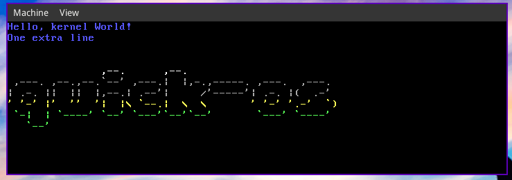

A tiny operating system for i686

## Build

* configure: `./config.sh`
* install headers (optional): `./headers.sh`
* build (optional): `./build.sh`
* create an iso image: `./iso.sh`
* run: `./qemu.sh`
* clean: `./clean.sh`

## Dependencies

The basic dependencies before building and using this operating system are:
* QEMU (i386)
* i686-elf toolchain (see [here](https://wiki.osdev.org/Meaty_Skeleton#Building_a_Cross-Compiler))
* GRUB with i386-pc support (e.g. add `pc` to the `GRUB_PLATFORMS` flag on Gentoo, install `grub-pc-bin` on Debian/Ubuntu)
* xorriso (which might be included into `libisoburn`)
* GNU make v4.0 or later
* A GNU/Linux system for testing

## Development progress

Bare bones:
* boot
* initialize stack and the rest of the environment
* enter kernel

VGA terminal driver:
* support for newline
* terminal scrolling
* render ascii logo

Architecture:
* extensible libk and libc
* make build system support

## Credits

The skeleton structure of this operating system was taken from [the following guide](https://wiki.osdev.org/Hard_Build_System) on OSDev Wiki.
