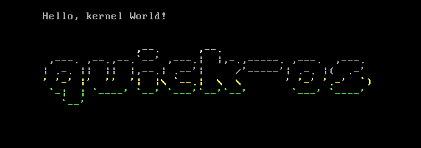

Just a tiny operating system for i686. =D

### Development progress

Bare bones:
* boot
* initialize stack and the rest of the environment
* enter kernel

VGA terminal driver:
* support for newline
* terminal scrolling
* render ascii logo
